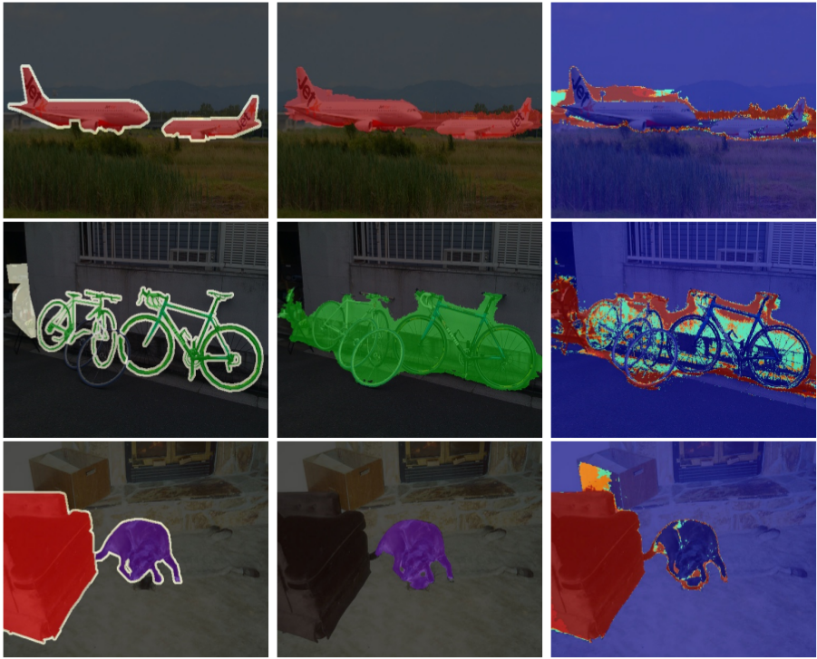
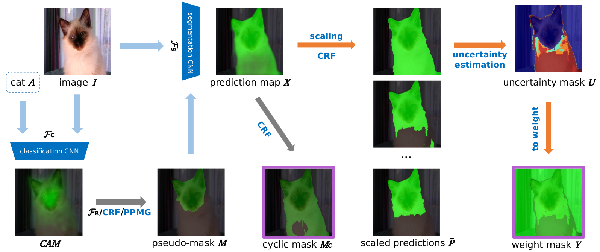

# Uncertainty Estimation via Response Scaling for Pseudo-mask Noise Mitigation in Weakly-supervised Semantic Segmentation

### Introduction

This is a PyTorch implementation of [Uncertainty Estimation via Response Scaling for Pseudo-mask Noise Mitigation in Weakly-supervised Semantic Segmentation](https://arxiv.org/pdf/2108.12995.pdf) (AAAI2022), based on [mmsegmentation](https://github.com/open-mmlab/mmsegmentation). Please refer the classification phase to [PMM](https://github.com/Eli-YiLi/PMM) and refer the segmentation phase to [WSSS_MMSeg](https://github.com/Eli-YiLi/WSSS_MMSeg).

In this papper, we mitigate the noise of pseudo-mask in segmentation phase via uncertainty from response scaling which simulates the behavior of noise. This technique is applicable to all weakly-supervised semantic segmentation methods based on fully-supervised semantic segmentation.

Uncertainty visualization

Framework visualization

### Preparation
(Extract code of BaiduYun: mtci)
##### Datasets and pretrained weights
VOC12 [OneDrive](https://1drv.ms/f/s!Agn5nXKXMkK5aigB0g238YxuTxs), [BaiduYun](https://pan.baidu.com/s/1GL3zXZuapuXmH9E7Xy8-Fg);
COCO14 [BaiduYun](https://pan.baidu.com/s/1GL3zXZuapuXmH9E7Xy8-Fg);
Pretrained weights [OneDrive](https://1drv.ms/f/s!Agn5nXKXMkK5aigB0g238YxuTxs), [BaiduYun](https://pan.baidu.com/s/1GL3zXZuapuXmH9E7Xy8-Fg)
##### Pseduo-masks from classification phase
Pseudo-masks (if you want to skip cls phase), [VOC12 OneDrive](https://onedrive.live.com/?authkey=%21ACgB0g238YxuTxs&cid=B9423297729DF909&id=B9423297729DF909%21110&parId=B9423297729DF909%21109&o=OneUp), [COCO14 BaiduYun](https://pan.baidu.com/s/1GL3zXZuapuXmH9E7Xy8-Fg)
##### Intermediate segmentation weights for uncertainty and cyclic pseudo-mask
Intermediate weights (if you want to skip first segmentation), [BaiduYun](https://pan.baidu.com/s/1GL3zXZuapuXmH9E7Xy8-Fg)
##### Released segmentation weights for test and visualization 
Released weights, [BaiduYun](https://pan.baidu.com/s/1GL3zXZuapuXmH9E7Xy8-Fg)

Once downloaded, execute the following commands to link the datasets and weights.

    git clone https://github.com/XMed-Lab/URN.git
    cd URN
    mkdir data
    cd  data
    ln -s [path to model files] models
    ln -s [path to voc12] voc12
    ln -s [path to coco2014] coco2014
    ln -s [path to your voc pseudo-mask] voc12/VOC2012/ppmg
    ln -s [path to your coco pseudo-mask] coco2014/voc_format/ppmg

### Run the code
(If you don't run on server cluster based on srun, please modify the scripts "tools/dist_\*.sh" refer to given scripts "tools/srun_\*.sh")

##### Installation
    cd URN
    pip install mmcv==1.1.5
    pip install -e .
(If you meet installation problems, please refer to [mmsegmentation](https://github.com/open-mmlab/mmsegmentation/blob/master/docs/get_started.md#installation))

##### Train segmentation for the first time (you can skip it by intermediate weights)
    cd URN
    bash tools/slurm_train.sh [cluster partition] python configs/pspnet_wsss/pspnet_res2net_20k_voc12aug_pus.py work_dirs/voc12_r2n_pus 8

##### Uncertainty estimation and generate cyclic pseudo-mask
    bash tools/slurm_test.sh [cluster partition] python configs/pspnet_wsss/pspnet_res2net_20k_voc12aug_uncertainty.py [intermediate weights] 8
    
##### Train segmentation with reweight strategy
    bash tools/slurm_train.sh [cluster partition] python configs/pspnet_wsss/pspnet_res2net_20k_voc12aug_urn.py work_dirs/voc12_r2n_urn 8

##### Notes:
1. We provide other backbones, including ResNet101, ScaleNet101, Wide-ResNet38
2. Configs of COCO14 are provided in "configs/pspnet_wsss"
3. It's suggested to use multiple cluster nodes to accelerate the genetation of pseudo-mask when use "tools/slurm_test.sh"
4. Run "tools/run_pmm.sh" to get baselines of PMM

### License
Please refer to: [LICENSE](LICENSE).
